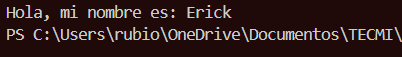
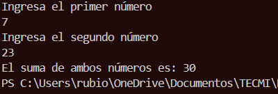
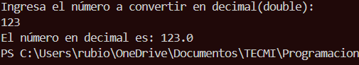
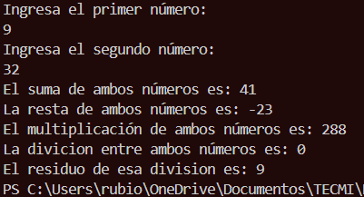
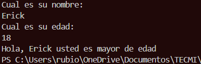
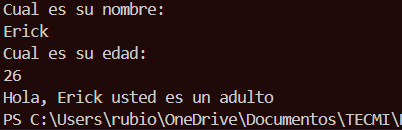
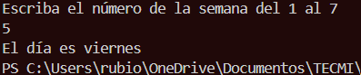
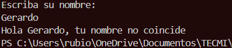
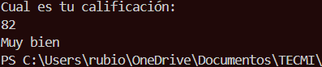
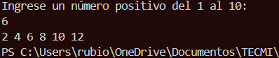

# Ejercicios básicos Java: tipos, Scanner, Strings y selección
Cada ejercicio debe resolverse en un programa Java independiente (puedes usar un
solo `main` y modificarlo entre ejercicios). Usa `Scanner` para las entradas por
teclado cuando aplique.
---
## Ejercicio 1: Saludo simple
**Enunciado**
Escribe un programa que guarde tu nombre en una variable `String` y lo muestre en
pantalla con el mensaje: `Hola, <nombre>`.
**Codigo**
```java
public class ejercicio1 {
    public static void main(String[] args) {
        String nombre = "Erick";
        System.out.println("Hola, mi nombre es: " + nombre);
    }
}
```
**Salida esperada (ejemplo)**

---
## Ejercicio 2: Suma de dos enteros
**Enunciado**
Escribe un programa que pida por teclado dos números enteros y muestre la suma de
ambos.
**Codigo**
```java
import java.util.Scanner;
public class ejercicio2 {
    public static void main(String[] args) {
        Scanner sc = new Scanner(System.in);
        System.out.println("Ingresa el primer número: ");
        int priNum = sc.nextInt();
        System.out.println("Ingresa el segundo número: ");
        int segNum = sc.nextInt();
        int total = priNum + segNum;
        System.out.println("El suma de ambos números es: " + total);
    }
}
```
**Salida esperada**

---
## Ejercicio 3: Conversión de double a int (casting)
**Enunciado**
Escribe un programa que pida un número decimal (double), lo convierta a entero
usando casting y muestre ambos valores.
**Codigo**
```java
import java.util.Scanner;
public class ejercicio3 {
    public static void main(String[] args) {
        Scanner sc = new Scanner(System.in);
        System.out.println("Ingresa el número a convertir en decimal(double): ");
        int numInt = sc.nextInt();
        double numDec = (double) numInt;
        System.out.println("El número en decimal es: " + numDec);
    }
}
```
**Salida esperada**

---
## Ejercicio 4: Calculadora básica con operadores
**Enunciado**
Escribe un programa que pida dos enteros e imprima: suma, resta, multiplicación,
división entera y el residuo (módulo) de la división.
**Codigo**
```java
import java.util.Scanner;
public class ejercicio4 {
    public static void main(String[] args) {
        Scanner sc = new Scanner(System.in);
        System.out.println("Ingresa el primer número: ");
        int priNum = sc.nextInt();
        System.out.println("Ingresa el segundo número: ");
        int segNum = sc.nextInt();
        int suma = priNum + segNum;
        int resta = priNum - segNum;
        int multi = priNum * segNum;
        int divs = priNum / segNum;
        int modu = priNum % segNum;
        System.out.println("El suma de ambos números es: " + suma);
        System.out.println("La resta de ambos números es: " + resta);
        System.out.println("El multiplicación de ambos números es: " + multi);
        System.out.println("La divicion entre ambos números es: " + divs);
        System.out.println("El residuo de esa division es: " + modu);
    }
}
```
**Salida esperada**

---
## Ejercicio 5: Mayor de edad (if-else)
**Enunciado**
Escribe un programa que pida la edad del usuario y muestre si es mayor o menor de
edad usando `if-else`.
**Codigo**
```java
import java.util.Scanner;
public class ejercicio5 {
    public static void main(String[] args) {
        Scanner sc = new Scanner(System.in);
        System.out.println("Cual es su nombre: ");
        String nombre = sc.nextLine();
        System.out.println("Cual es su edad: ");
        int edad = sc.nextInt();
        if (edad >= 18 ) {
            System.out.println("Hola, " + nombre + " usted es mayor de edad");
        } else {
            System.out.println("Hola, " + nombre + " usted es menor de edad");
        }
    }
}
```
**Salida esperada**

---
## Ejercicio 6: Clasificación por rango de edad (if-else if)
**Enunciado**
Escribe un programa que pida la edad y muestre un mensaje según el rango:
- Menor de 13: “Eres un niño.”
- De 13 a 17: “Eres un adolescente.”
- De 18 a 64: “Eres un adulto.”
- 65 o más: “Eres un adulto mayor.”
**Codigo**
```java 
import java.util.Scanner;
public class ejercicio6 {
    public static void main(String[] args) {
        Scanner sc = new Scanner(System.in);
        System.out.println("Cual es su nombre: ");
        String nombre = sc.nextLine();
        System.out.println("Cual es su edad: ");
        int edad = sc.nextInt();
        if (edad < 13 ) {
            System.out.println("Hola, " + nombre + " usted es un niño");
        } else if (edad >= 13 && edad <= 17) {
            System.out.println("Hola, " + nombre + " usted es un adolescente");
        } else if (edad >= 18 && edad <= 64){
            System.out.println("Hola, " + nombre + " usted es un adulto");
        } else if (edad >= 65) {
            System.out.println("Hola, " + nombre + " usted es un adulto mayor");
        }
    }
}
```
**Salida esperada**

---
## Ejercicio 7: Día de la semana (switch)
**Enunciado**
Escribe un programa que pida un número del 1 al 7 y muestre el día de la semana
correspondiente usando `switch`.
- 1: Lunes
- 2: Martes
- 3: Miércoles
- 4: Jueves
- 5: Viernes
- 6: Sábado
- 7: Domingo
**Codigo**
```java
import java.util.Scanner;

public class ejercicio7 {
    public static void main(String[] args) {
        Scanner sc = new Scanner(System.in);
        System.out.println("Escriba el número de la semana del 1 al 7");
        int dia = sc.nextInt();
        switch (dia) {
            case 1:
                System.out.println("El día es lunes");
                break;
            case 2:
                System.out.println("El día es martes");
                break;
            case 3:
                System.out.println("El día es miercoles");
                break;
            case 4:
                System.out.println("El día es jueves");
                break;
            case 5:
                System.out.println("El día es viernes");
                break;
            case 6:
                System.out.println("El día es sabado");
                break;
            case 7:
                System.out.println("El día es domingo");
                break;
            default:
                System.out.println("Opcion no disponible");
                break;
        }
    }
}
```
**Salida esperada**

---
## Ejercicio 8: Comparación de nombres con equalsIgnoreCase
**Enunciado**
Escribe un programa que pida al usuario su nombre y lo compare con un nombre
definido en el código (por ejemplo, `"Ricardo"`).
- Si coincide (ignorando mayúsculas/minúsculas) muestra: `Hola <nombre>,
bienvenido.`
- Si no coincide, muestra: `Hola <nombre>, tu nombre no coincide.`
Este ejercicio se parece a la **Parte 1 de la Actividad 2** de tu curso.
**Codigo**
```java
import java.util.Scanner;

public class ejercicio8 {
    public static void main(String[] args) {
        Scanner sc = new Scanner(System.in);
        System.out.println("Escriba su nombre: ");
        String nombre = sc.nextLine();
        String nomb = "ERICK";
        boolean comp = nombre.equalsIgnoreCase(nomb);
        if (comp == false){
            System.out.println("Hola " + nombre + ", tu nombre no coincide");
        } else if (comp == true){
            System.out.println("Hola " + nombre + ", tu nombre si coincide");
        }
    }
}
```
**Salida esperada**

---
## Ejercicio 9: Clasificación de calificación (if-else y operadores lógicos)
**Enunciado**
Escribe un programa que pida una calificación entera de 0 a 100 y muestre:
- 90 a 100: “Excelente”
- 80 a 89: “Muy bien”
- 70 a 79: “Aprobado”
- 0 a 69: “Reprobado”
Si la calificación está fuera de ese rango, muestra: “Calificación inválida”.
**Codigo**
```java
import java.util.Scanner;

public class ejercicio9 {
    public static void main(String[] args) {
        Scanner sc = new Scanner(System.in);
        System.out.println("Cual es tu calificación: ");
        int cal = sc.nextInt();
        if (cal <= 69 ) {
            System.out.println("Reprobado");
        } else if (cal >= 70 && cal <= 79) {
            System.out.println("Aprobado");
        } else if (cal >= 80 && cal <= 89){
            System.out.println("Muy bien");
        } else if (cal >= 90 && cal <= 100) {
            System.out.println("Excelente");
        } else {
            System.out.println("Calificacion inexistente");
        }
    }
}
```
**Salida esperada**

---
## Ejercicio 10: Números pares en un rango (for + arreglo pequeño)
**Enunciado**
Escribe un programa que:
1. Pida un número entero **positivo** `n` (por ejemplo, máximo 10 para que sea
sencillo).
2. Genere los primeros `n` números pares empezando desde 2.
3. Guarde esos números en un arreglo.
4. Recorra el arreglo y muestre los números en una sola línea separados por
espacio.
Este ejercicio es una versión pequeña de la **Parte 2 de la Actividad 2** (pares y
arreglos).
**Codigo**
```java
import java.util.Scanner;

public class ejercicio10 {
    public static void main(String[] args) {
        Scanner sc = new Scanner(System.in);
        System.out.println("Ingrese un número positivo del 1 al 10: ");
        int n = sc.nextInt();
        int[] pares = new int[n];
        for (int i = 0; i < n; i++) {
            pares[i] = 2 * (i + 1);
        }
        for (int i = 0; i < n; i++) {
            System.out.print(pares[i] + " ");
        }
    }
}
```
**Salida esperada**

