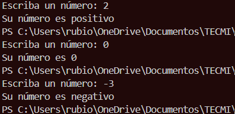
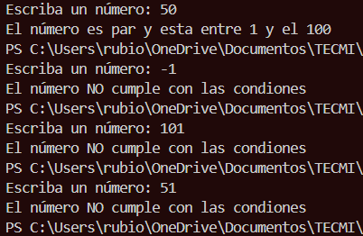
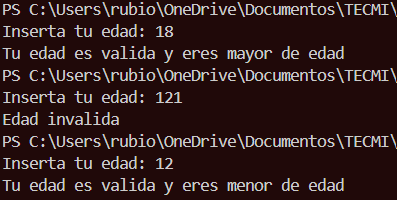
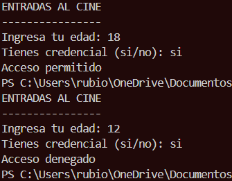
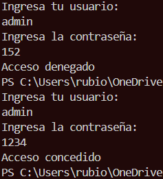
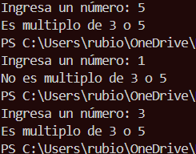
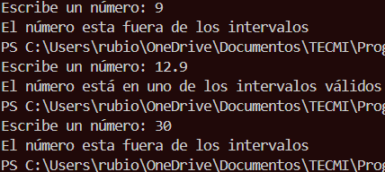
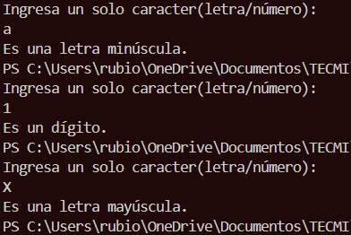
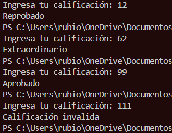
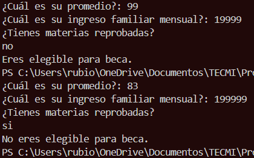

# Actividad 2
**Enunciado**
Asegúrate de contar con acceso a un entorno de desarrollo Java y, después, realiza lo siguiente:

**Parte 1**. Strings y estructuras de selección

Crea un programa Java que solicite al usuario ingresar su nombre.
Utiliza estructuras de selección (if o switch) para verificar si el nombre ingresado coincide con uno específico que definas en tu programa; dependiendo de la coincidencia, muestra un mensaje personalizado.
Aprovecha las operaciones de manejo de cadenas de texto para, así, realizar comparaciones con sensibilidad a mayúsculas o minúsculas y, de esta manera, proporcionar mensajes adecuados.

**Parte 2**. Estructuras de repetición y arreglos

Desarrolla un programa que genere una lista de números enteros pares desde dos hasta 100; para lograrlo, puedes utilizar una estructura de repetición (for o while).
Almacena estos números en un arreglo.
Luego, utiliza una estructura de repetición para recorrer el arreglo y mostrar en pantalla los números almacenados.
---
**Codigo**
```java
import java.util.Scanner;

public class Actividad2 {
    public static void main(String[] args) {
        Scanner sc = new Scanner(System.in);
        System.out.print("Ingrese su nombre: ");
        String nombre = sc.nextLine();
        String nombre1 = "Erick";
        String nombre2 = "Patricio";
        String nombre3 = "Daisy";

        if (nombre.equalsIgnoreCase(nombre1) || nombre.equalsIgnoreCase(nombre2) || nombre.equalsIgnoreCase(nombre3)){
            System.out.println("Hola, " + nombre + " bienvenido de vuelta");
        } else {
            System.out.println("Hola, " + nombre + " no te reconozco");
        }

        int[] pares = new int[50];
        int indice = 0;
        for (int i = 2; i <= 100; i += 2) {
            pares[indice] = i;
            indice++;
        }
        System.out.println("Números pares del 2 al 100:");
        for (int i = 0; i < pares.length; i++) {
            System.out.println(pares[i]);
        }
    }
}
```
**Salida esperada(ejemplo)**
---

---
# Ejercicios básicos Java: tipos, Scanner, Strings y selección
Cada ejercicio debe resolverse en un programa Java independiente (puedes usar un
solo `main` y modificarlo entre ejercicios). Usa `Scanner` para las entradas por
teclado cuando aplique.
---
## Ejercicio 1: Saludo simple
**Enunciado**
Escribe un programa que guarde tu nombre en una variable `String` y lo muestre en
pantalla con el mensaje: `Hola, <nombre>`.
---
**Codigo**
```java
public class ejercicio1 {
    public static void main(String[] args) {
        String nombre = "Erick";
        System.out.println("Hola, mi nombre es: " + nombre);
    }
}
```
**Salida esperada (ejemplo)**
---

---
## Ejercicio 2: Suma de dos enteros
**Enunciado**
Escribe un programa que pida por teclado dos números enteros y muestre la suma de
ambos.
---
**Codigo**
```java
import java.util.Scanner;
public class ejercicio2 {
    public static void main(String[] args) {
        Scanner sc = new Scanner(System.in);
        System.out.println("Ingresa el primer número: ");
        int priNum = sc.nextInt();
        System.out.println("Ingresa el segundo número: ");
        int segNum = sc.nextInt();
        int total = priNum + segNum;
        System.out.println("El suma de ambos números es: " + total);
    }
}
```
**Salida esperada**
---

---
## Ejercicio 3: Conversión de double a int (casting)
**Enunciado**
Escribe un programa que pida un número decimal (double), lo convierta a entero
usando casting y muestre ambos valores.
---
**Codigo**
```java
import java.util.Scanner;
public class ejercicio3 {
    public static void main(String[] args) {
        Scanner sc = new Scanner(System.in);
        System.out.println("Ingresa el número a convertir en decimal(double): ");
        int numInt = sc.nextInt();
        double numDec = (double) numInt;
        System.out.println("El número en decimal es: " + numDec);
    }
}
```
**Salida esperada**
---

---
## Ejercicio 4: Calculadora básica con operadores
**Enunciado**
Escribe un programa que pida dos enteros e imprima: suma, resta, multiplicación,
división entera y el residuo (módulo) de la división.
---
**Codigo**
```java
import java.util.Scanner;
public class ejercicio4 {
    public static void main(String[] args) {
        Scanner sc = new Scanner(System.in);
        System.out.println("Ingresa el primer número: ");
        int priNum = sc.nextInt();
        System.out.println("Ingresa el segundo número: ");
        int segNum = sc.nextInt();
        int suma = priNum + segNum;
        int resta = priNum - segNum;
        int multi = priNum * segNum;
        int divs = priNum / segNum;
        int modu = priNum % segNum;
        System.out.println("El suma de ambos números es: " + suma);
        System.out.println("La resta de ambos números es: " + resta);
        System.out.println("El multiplicación de ambos números es: " + multi);
        System.out.println("La divicion entre ambos números es: " + divs);
        System.out.println("El residuo de esa division es: " + modu);
    }
}
```
**Salida esperada**
---

---
## Ejercicio 5: Mayor de edad (if-else)
**Enunciado**
Escribe un programa que pida la edad del usuario y muestre si es mayor o menor de
edad usando `if-else`.
---
**Codigo**
```java
import java.util.Scanner;
public class ejercicio5 {
    public static void main(String[] args) {
        Scanner sc = new Scanner(System.in);
        System.out.println("Cual es su nombre: ");
        String nombre = sc.nextLine();
        System.out.println("Cual es su edad: ");
        int edad = sc.nextInt();
        if (edad >= 18 ) {
            System.out.println("Hola, " + nombre + " usted es mayor de edad");
        } else {
            System.out.println("Hola, " + nombre + " usted es menor de edad");
        }
    }
}
```
**Salida esperada**
---

---
## Ejercicio 6: Clasificación por rango de edad (if-else if)
**Enunciado**
Escribe un programa que pida la edad y muestre un mensaje según el rango:
- Menor de 13: “Eres un niño.”
- De 13 a 17: “Eres un adolescente.”
- De 18 a 64: “Eres un adulto.”
- 65 o más: “Eres un adulto mayor.”
---
**Codigo**
```java 
import java.util.Scanner;
public class ejercicio6 {
    public static void main(String[] args) {
        Scanner sc = new Scanner(System.in);
        System.out.println("Cual es su nombre: ");
        String nombre = sc.nextLine();
        System.out.println("Cual es su edad: ");
        int edad = sc.nextInt();
        if (edad < 13 ) {
            System.out.println("Hola, " + nombre + " usted es un niño");
        } else if (edad >= 13 && edad <= 17) {
            System.out.println("Hola, " + nombre + " usted es un adolescente");
        } else if (edad >= 18 && edad <= 64){
            System.out.println("Hola, " + nombre + " usted es un adulto");
        } else if (edad >= 65) {
            System.out.println("Hola, " + nombre + " usted es un adulto mayor");
        }
    }
}
```
**Salida esperada**
---

---
## Ejercicio 7: Día de la semana (switch)
**Enunciado**
Escribe un programa que pida un número del 1 al 7 y muestre el día de la semana
correspondiente usando `switch`.
- 1: Lunes
- 2: Martes
- 3: Miércoles
- 4: Jueves
- 5: Viernes
- 6: Sábado
- 7: Domingo
---
**Codigo**
```java
import java.util.Scanner;

public class ejercicio7 {
    public static void main(String[] args) {
        Scanner sc = new Scanner(System.in);
        System.out.println("Escriba el número de la semana del 1 al 7");
        int dia = sc.nextInt();
        switch (dia) {
            case 1:
                System.out.println("El día es lunes");
                break;
            case 2:
                System.out.println("El día es martes");
                break;
            case 3:
                System.out.println("El día es miercoles");
                break;
            case 4:
                System.out.println("El día es jueves");
                break;
            case 5:
                System.out.println("El día es viernes");
                break;
            case 6:
                System.out.println("El día es sabado");
                break;
            case 7:
                System.out.println("El día es domingo");
                break;
            default:
                System.out.println("Opcion no disponible");
                break;
        }
    }
}
```
**Salida esperada**
---

---
## Ejercicio 8: Comparación de nombres con equalsIgnoreCase
**Enunciado**
Escribe un programa que pida al usuario su nombre y lo compare con un nombre
definido en el código (por ejemplo, `"Ricardo"`).
- Si coincide (ignorando mayúsculas/minúsculas) muestra: `Hola <nombre>,
bienvenido.`
- Si no coincide, muestra: `Hola <nombre>, tu nombre no coincide.`
Este ejercicio se parece a la **Parte 1 de la Actividad 2** de tu curso.
---
**Codigo**
```java
import java.util.Scanner;

public class ejercicio8 {
    public static void main(String[] args) {
        Scanner sc = new Scanner(System.in);
        System.out.println("Escriba su nombre: ");
        String nombre = sc.nextLine();
        String nomb = "ERICK";
        boolean comp = nombre.equalsIgnoreCase(nomb);
        if (comp == false){
            System.out.println("Hola " + nombre + ", tu nombre no coincide");
        } else if (comp == true){
            System.out.println("Hola " + nombre + ", tu nombre si coincide");
        }
    }
}
```
**Salida esperada**
---

---
## Ejercicio 9: Clasificación de calificación (if-else y operadores lógicos)
**Enunciado**
Escribe un programa que pida una calificación entera de 0 a 100 y muestre:
- 90 a 100: “Excelente”
- 80 a 89: “Muy bien”
- 70 a 79: “Aprobado”
- 0 a 69: “Reprobado”
Si la calificación está fuera de ese rango, muestra: “Calificación inválida”.
---
**Codigo**
```java
import java.util.Scanner;

public class ejercicio9 {
    public static void main(String[] args) {
        Scanner sc = new Scanner(System.in);
        System.out.println("Cual es tu calificación: ");
        int cal = sc.nextInt();
        if (cal <= 69 ) {
            System.out.println("Reprobado");
        } else if (cal >= 70 && cal <= 79) {
            System.out.println("Aprobado");
        } else if (cal >= 80 && cal <= 89){
            System.out.println("Muy bien");
        } else if (cal >= 90 && cal <= 100) {
            System.out.println("Excelente");
        } else {
            System.out.println("Calificacion inexistente");
        }
    }
}
```
**Salida esperada**
---

---
## Ejercicio 10: Números pares en un rango (for + arreglo pequeño)
**Enunciado**
Escribe un programa que:
1. Pida un número entero **positivo** `n` (por ejemplo, máximo 10 para que sea
sencillo).
2. Genere los primeros `n` números pares empezando desde 2.
3. Guarde esos números en un arreglo.
4. Recorra el arreglo y muestre los números en una sola línea separados por
espacio.
Este ejercicio es una versión pequeña de la **Parte 2 de la Actividad 2** (pares y
arreglos).
---
**Codigo**
```java
import java.util.Scanner;

public class ejercicio10 {
    public static void main(String[] args) {
        Scanner sc = new Scanner(System.in);
        System.out.println("Ingrese un número positivo del 1 al 10: ");
        int n = sc.nextInt();
        int[] pares = new int[n];
        for (int i = 0; i < n; i++) {
            pares[i] = 2 * (i + 1);
        }
        for (int i = 0; i < n; i++) {
            System.out.print(pares[i] + " ");
        }
    }
}
```
**Salida esperada**
---

---
# Ejercicios Java: comparación y operadores lógicos
Todos los ejercicios deben resolverse usando **estructuras de selección** (`if`,
`if-else`, `if-else if`, `switch`) y **operadores lógicos** (`&&`, `||`, `!`,
relacionales). No uses estructuras repetitivas todavía.
---
## Ejercicio 11: Número positivo o negativo
**Enunciado**
Escribe un programa que pida un número entero y muestre si es positivo, negativo o
cero usando `if-else if-else`.
---
**Codigo**
```java
import java.util.Scanner;

public class ejercicio11 {
    public static void main(String[] args) {
        Scanner sc = new Scanner(System.in);
        System.out.print("Escriba un número: ");
        int num = sc.nextInt();
        if (num == 0) {
            System.out.println("Su número es 0");
        } else if (num > 0) {
            System.out.println("Su número es positivo");
        } else if (num < 0) {
            System.out.println("Su número es negativo");
        }
    }
}
```
**Salida esperada**
---

---
## Ejercicio 12: Par y dentro de rango
**Enunciado**
Escribe un programa que pida un número entero y verifique **dos condiciones**:
- Que sea par.
- Que esté entre 1 y 100 (inclusive).
Si se cumplen ambas, muestra: `El número es par y está entre 1 y 100.`
En otro caso, muestra: `El número NO cumple las condiciones.`
Usa operadores lógicos (`&&`).
---
**Codigo**
```java
import java.util.Scanner;

public class ejercicio12 {
    public static void main(String[] args) {
        Scanner sc = new Scanner(System.in);
        System.out.print("Escriba un número: ");
        int num = sc.nextInt();
        if (num%2 == 0 && num>0 && num<=100){
            System.err.println("El número es par y esta entre 1 y el 100");
        } else {
            System.out.println("El número NO cumple con las condiones");
        }
    }
}
```
**Salida esperada**
---

---
## Ejercicio 13: Edad válida y mayor de edad
**Enunciado**
Escribe un programa que pida una edad entera y verifique:
1. Que la edad esté en el rango 0 a 120.
2. Que sea mayor o igual a 18.
Si la edad es inválida (fuera de 0 a 120) muestra: `Edad inválida.`
Si es válida y mayor o igual a 18, muestra: `Edad válida y eres mayor de edad.`
Si es válida y menor a 18, muestra: `Edad válida y eres menor de edad.`
---
**Codigo**
```java
import java.util.Scanner;

public class ejercicio13 {
    public static void main(String[] args) {
        Scanner sc = new Scanner(System.in);
        System.err.print("Inserta tu edad: ");
        int edad = sc.nextInt();
        if (edad > 0 && edad <120){
            if (edad >= 18){
                System.out.println("Tu edad es valida y eres mayor de edad");
            } else if (edad < 18){
                System.out.println("Tu edad es valida y eres menor de edad");
            }
        } else {
            System.err.println("Edad invalida");
        }
    }
}

```
**Salida esperada**
---

---
## Ejercicio 14: Acceso a sala por edad y credencial
**Enunciado**
Una sala de cine solo permite acceso si:
- La edad es mayor o igual a 15 **y**
- La persona tiene credencial de estudiante (`true` / `false`).
Pide la edad y luego pide si tiene credencial (puedes leer `"si"` o `"no"` y
convertir a un `boolean`).
Usa `&&` para decidir si puede pasar.
---
**Codigo**
```java
import java.util.Scanner;

public class ejercicio14 {
    public static void main(String[] args) {
        Scanner sc = new Scanner(System.in);
        System.out.println("ENTRADAS AL CINE");
        System.out.println("----------------");
        System.out.print("Ingresa tu edad: ");
        int edad = sc.nextInt();
        sc.nextLine();
        System.out.print("Tienes credencial (si/no): ");
        String op = sc.nextLine();
        if (op.equalsIgnoreCase("si") || op.equalsIgnoreCase("no")) {
            if (edad >= 15 && op.equalsIgnoreCase("si")) {
                System.out.println("Acceso permitido");
            } else {
                System.out.println("Acceso denegado");
            }
        } else {
            System.out.println("Opción no válida");
        }
    }
}
```
**Salida esperada**
---

---
## Ejercicio 15: Usuario y contraseña correctos
**Enunciado**
En el código define dos `String` con usuario y contraseña correctos, por ejemplo:
- Usuario correcto: `"admin"`
- Contraseña correcta: `"1234"`
Pide al usuario que ingrese usuario y contraseña.
Usa operadores lógicos y comparación de cadenas (`equals`) para mostrar:
- `Acceso concedido.` si **ambos** coinciden.
- `Acceso denegado.` en cualquier otro caso.
---
**Codigo**
```java
import java.util.Scanner;

public class ejercicio15 {
    public static void main(String[] args) {
        Scanner sc = new Scanner(System.in);
        System.out.println("Ingresa tu usuario: ");
        String user = sc.nextLine();
        System.out.println("Ingresa la contraseña: ");
        int conts = sc.nextInt();
        String cUser = "admin";
        int cConts = 1234;
        if (user.equals(cUser) && conts == cConts){
            System.out.println("Acceso concedido");
        } else {
            System.out.println("Acceso denegado");
        }
    }
}
```
**Salida esperada**
---

---
## Ejercicio 16: Múltiplo de 3 o de 5
**Enunciado**
Escribe un programa que pida un número entero y determine:
- Si es múltiplo de 3 **o** de 5.
Si se cumple alguna de las dos condiciones, muestra: `Es múltiplo de 3 o de 5.`
En caso contrario, muestra: `No es múltiplo de 3 ni de 5.`
Usa el operador `||`.
---
**Codigo**
```java
import java.util.Scanner;

public class ejercicio16 {
    public static void main(String[] args) {
        Scanner sc = new Scanner(System.in);
        System.out.print("Ingresa un número: ");
        int num = sc.nextInt();
        if (num%3 == 0 || num%5 == 0) {
            System.out.println("Es multiplo de 3 o 5");
        } else {
            System.out.println("No es multiplo de 3 o 5");
        }
    }
}
```
**Salida esperada**
---

---
## Ejercicio 17: Dentro de intervalo cerrado o abierto
**Enunciado**
Escribe un programa que pida un número decimal y determine si:
- Está en el intervalo **cerrado** [10, 20] (incluye 10 y 20).
- O está en el intervalo **abierto** (30, 40) (no incluye 30 ni 40).
Si está en alguno de los dos intervalos, muestra:
`El número está en uno de los intervalos válidos.`
Si no, muestra:
`El número está fuera de los intervalos.`
Usa operadores relacionales y `||`.
---
**Codigo**
```java
import java.util.Scanner;

public class ejercicio17 {
    public static void main(String[] args) {
        Scanner sc = new Scanner(System.in);
        System.out.print("Escribe un número: ");
        double num = sc.nextDouble();
        if (num >= 10.0 && num <= 20.0 || num > 30.0 && num < 40.0) {
            System.out.println("El número está en uno de los intervalos válidos");
        } else {
            System.out.println("El número esta fuera de los intervalos");
        }
    }
```
**Salida esperada**
---

---
## Ejercicio 18: Clasificación de carácter
**Enunciado**
Escribe un programa que pida un solo carácter (puedes leer un `String` y tomar
`charAt(0)`) y determine si es:
- Una letra mayúscula (`'A'` a `'Z'`)
- Una letra minúscula (`'a'` a `'z'`)
- Un dígito (`'0'` a `'9'`)
- Otro símbolo cualquiera
Usa comparaciones de rangos con operadores lógicos (`&&`, `||`) y muestra solo uno
de los siguientes mensajes:
- `Es una letra mayúscula.`
- `Es una letra minúscula.`
- `Es un dígito.`
- `Es otro tipo de carácter.`
---
**Codigo**
```java
import java.util.Scanner;

public class ejercicio18 {
    public static void main(String[] args) {
        Scanner sc = new Scanner(System.in);
        System.out.println("Ingresa un solo caracter(letra/número): ");
        String original = sc.nextLine();
        char letra = original.charAt(0);
        if (letra >= 'A' && letra <= 'Z') {
            System.out.println("Es una letra mayúscula.");
        } else if (letra >= 'a' && letra <= 'z') {
            System.out.println("Es una letra minúscula.");
        } else if (letra >= '0' && letra <= '9') {
            System.out.println("Es un dígito.");
        } else {
            System.out.println("Es otro tipo de carácter.");
        }
    }
}
```
**Salida esperada**
---

---
## Ejercicio 19: Aprobado, extraordinario o reprobado
**Enunciado**
Escribe un programa que pida una calificación entera de 0 a 100 y muestre:
- Si es menor a 0 o mayor a 100: `Calificación inválida.`
- Si está entre 70 y 100 (inclusive): `Aprobado.`
- Si está entre 60 y 69 (inclusive): `Extraordinario.`
- Si está entre 0 y 59 (inclusive): `Reprobado.`
Usa `if`, `else if` y operadores lógicos para los rangos.
---
**Codigo**
```java
import java.util.Scanner;

public class ejercicio19 {
    public static void main(String[] args) {
        Scanner sc = new Scanner(System.in);
        System.out.print("Ingresa tu calificación: ");
        int calf = sc.nextInt();
        if (calf == 0 || calf > 100) {
            System.out.println("Calificación invalida");
        } else if (calf >= 70 && calf <= 100) {
            System.out.println("Aprobado");
        } else if (calf >= 60 && calf <= 69) {
            System.out.println("Extraordinario");
        } else if (calf <= 59) {
            System.out.println("Reprobado");
        }
    }
}
```
**Salida esperada**
---

---
## Ejercicio 20: Elegible para beca
**Enunciado**
Una universidad otorga beca si se cumplen las siguientes condiciones:
- Promedio mayor o igual a 85.
- Ingreso familiar mensual menor a 20,000.
- Y **no** tiene materias reprobadas (`true` / `false`).
Escribe un programa que pida promedio (double), ingreso (double) y si tiene
materias reprobadas (puedes leer `"si"`/`"no"` y convertirlo a `boolean`).
Usa operadores lógicos `&&` y `!` para mostrar:
- `Eres elegible para beca.` si se cumplen todas las condiciones.
- `No eres elegible para beca.` en caso contrario.
---
**Codigo**
```java
import java.util.Scanner;

public class ejercicio20 {
    public static void main(String[] args) {
        Scanner sc = new Scanner(System.in);
        System.out.print("¿Cuál es su promedio?: ");
        int calif = sc.nextInt();
        System.out.print("¿Cuál es su ingreso familiar mensual?: ");
        int inger = sc.nextInt();
        sc.nextLine();
        System.out.println("¿Tienes materias reprobadas?");
        String op = sc.nextLine();
        boolean opR = op.equalsIgnoreCase("si");

        if (calif >= 85 && inger < 20000 && !opR) {
            System.out.println("Eres elegible para beca.");
        } else {
            System.out.println("No eres elegible para beca.");
        }
    }
}
```
**Salida esperada**
---


